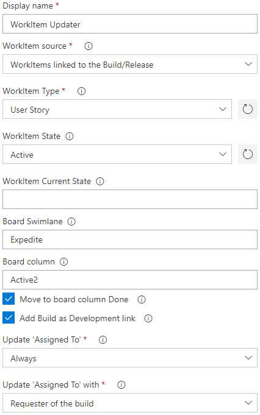

# WorkItem Updater

## Overview
The WorkItem Updater task can update the following workitem fields during a build or release:
- Update the state for workitems linked to a build.  
- Update the assignee for workitems linked to a build.  
- Add the build as Development Link to the workitems.
  
By adding this task to specific milestones in a build/release pipeline, you can create an automated kanban board.  
As an example would be to set the state to 'Resolved' as the last step of a build and to 'Deployed' as the last step of a release.  
With this task the state of workitems is always reflecting reality and developers don't need to manually update workitems anymore.  
  
A preview of what the task can do, can be seen in this recording:  
  
  
  
## Settings
  
  
The task requires the following settings:
- WorkItem Type
  - Only linked workitems of this type will be updated.
- WorkItem State
  - The state that the workitem should be updated to.
- WorkItem Current State
  - The state that the workitem should be updated from. Multiple values can be provided. Empty to update from any state.
- Move to board column Done
  - If the workitem is displayed in a Kanban column that has been split into Doing and Done, this indicates if the workitem should be moved to the Done column.
- Add Build as Development link
  - If checked the build will be added as a Development link to the WorkItem.
- Update 'Assigned To' with requester of the build
  - The following options are available to configure when the "Assigned To" field should be updated with the person who requested the build.
    - Never
    - Only if unassigned
    - Always
  
## Version History
### 1.2.0
- Add Build as Development link
- Update 'Assigned To' with requester of the build
### 1.1.8
- Initial Version